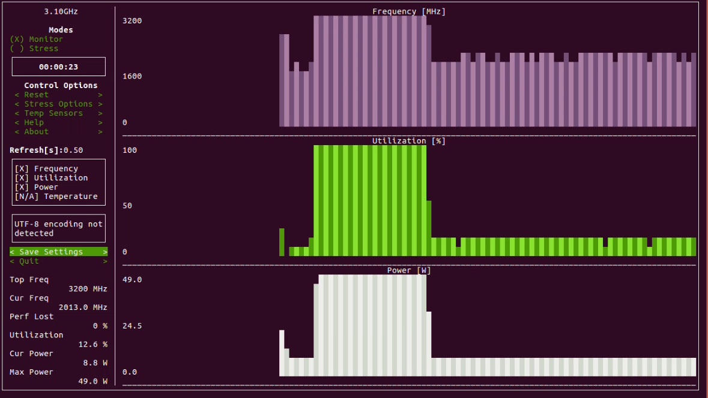

# system-monitoring-tool
A script to install and run stress and s-tui for system performance monitoring on Linux.

# System Monitoring Tool

This repository contains a script to install and run `stress` and `s-tui` for monitoring system performance on Linux. Additionally, it includes a Dockerfile for containerized usage.

## Features

- Installs `stress` for system stress testing
- Installs `s-tui` for terminal-based monitoring of system performance
- Provides a simple interface to run these tools
- Docker support for containerized execution

## Installation

To use this tool, you need to have Python 3 installed on your system.

1. **Clone the repository**:
    ```bash
    git clone https://github.com/sydtalhaa/system-monitoring-tool.git
    cd system-monitoring-tool
    ```

2. **Run the script**:
    ```bash
    [sudo] python3 main.py
    ```

## Docker Usage

If you prefer to use Docker, follow these steps:

1. **Build the Docker image**:
    ```bash
    docker build -t system-monitoring-tool .
    ```

2. **Run the Docker container**:
    ```bash
    docker run --rm -it --privileged system-monitoring-tool
    ```

## Usage

The script will:
1. Update your package list.
2. Install the `stress` package for stress testing the CPU.
3. Install the `s-tui` package for monitoring system performance.
4. Run `s-tui` to start monitoring.

## Requirements

- Python 3
- A Linux system with `apt` package manager
- Docker (optional, for containerized usage)



## License

This project is licensed under the MIT License - see the [LICENSE](LICENSE) file for details.

## Contributing

If you would like to contribute to this project, please fork the repository and submit a pull request. Issues and feature requests are welcome.

## Acknowledgements

- [stress](https://people.seas.harvard.edu/~apw/stress/) - A tool to impose load on and stress test systems
- [s-tui](https://github.com/amanusk/s-tui) - A terminal UI for monitoring your computer

## Contact

If you have any questions or suggestions, feel free to open an issue or contact the repository owner.
